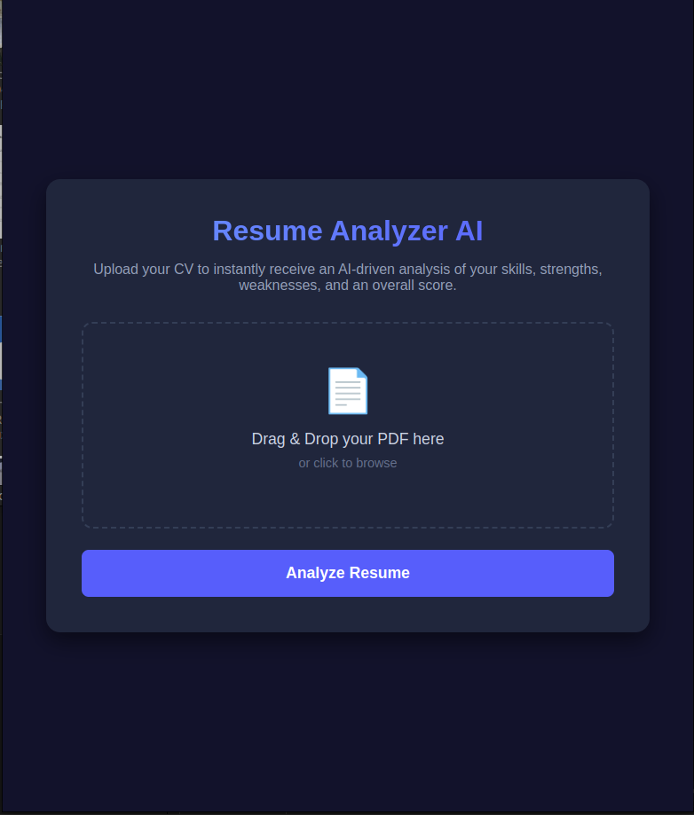
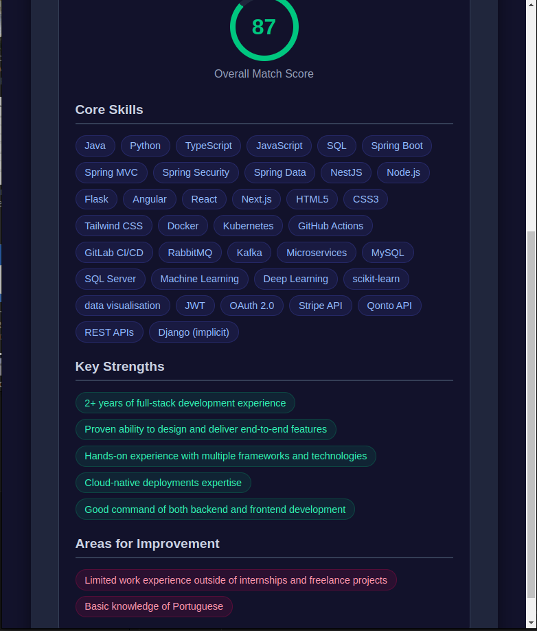

# 📄 Resume Analyzer AI

Welcome to the **Resume Analyzer AI** project! This intelligent application is designed to instantly extract and evaluate CV data (from PDF files) to provide you with actionable career insights.

## 🚀 Features

- **Instant Insights**: Extracts text from PDF resumes accurately.
- **AI-Powered Evaluation**: Analyzes your resume using the high-performance Llama 3 model (via Groq API).
- **Comprehensive Scorecard**: Highlights your Core Skills, Key Strengths, Areas for Improvement, and an overall Match Score (out of 100).
- **Secure & Local**: Fast processing right from your server securely using FastAPI.
- **Modern Interface**: A sleek, dark-themed drag-and-drop user interface built with HTML, CSS, JavaScript, and Jinja2 templates.

## 📸 Screenshots

*(Replace the paths below with your actual screenshot images once you take them)*

### Main Interface - Uploading CV


### AI Analysis Results


---

## 🛠️ Technologies Used

- **Backend:** Python, FastAPI, Uvicorn
- **Frontend:** HTML, CSS, Vanilla JavaScript, Jinja2
- **Document Processing:** PyMuPDF (`fitz`), `python-multipart`
- **AI Intelligence:** Groq API (Llama 3.1 8B Instant)

## 📋 Prerequisites

- Python 3.10+
- A valid [Groq API Key](https://console.groq.com)

## ⚡ Quick Start

1. **Clone the repository:**
   ```bash
   git clone https://github.com/NourhenAyadi/-resume-analyzer.git
   cd -resume-analyzer
   ```

2. **Create a Virtual Environment & Install Dependencies:**
   ```bash
   python3 -m venv venv
   source venv/bin/activate
   pip install -r requirements.txt
   ```

3. **Set up Environment Variables:**
   Create a `.env` file in the root directory (or parent directory) and add your Groq API key:
   ```env
   GROQ_API_KEY="your_groq_api_key_here"
   ```

4. **Run the Application:**
   ```bash
   uvicorn main:app --port 8005 --reload
   ```

5. **Open your browser:**
   Navigate to [http://localhost:8005](http://localhost:8005) and drop your CV to be analyzed!

---

💡 *Developed by Nourhen Ayadi.*
